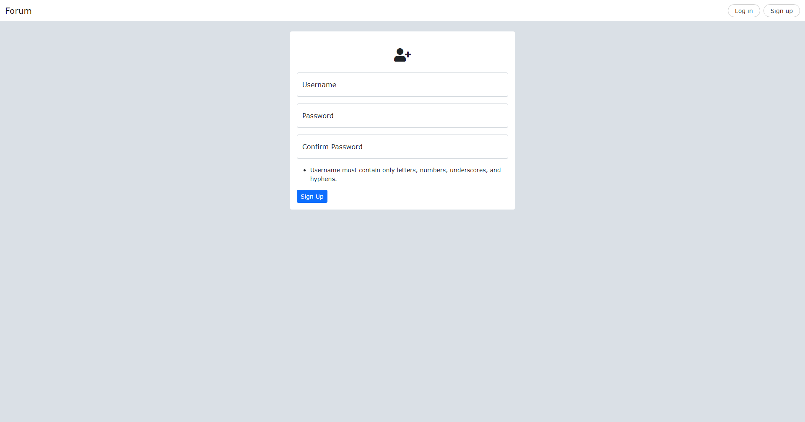
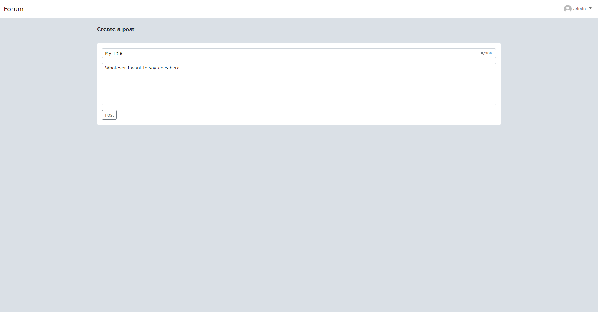
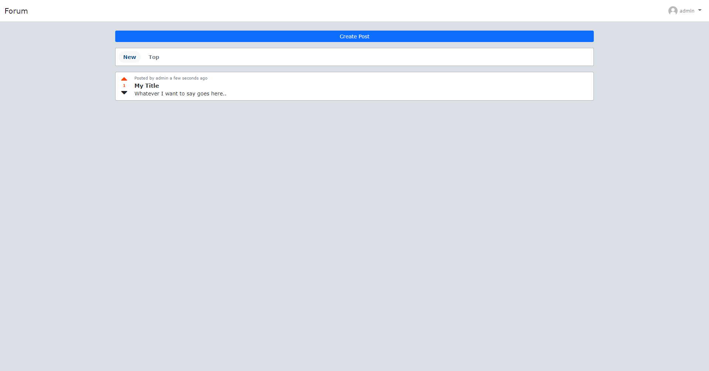
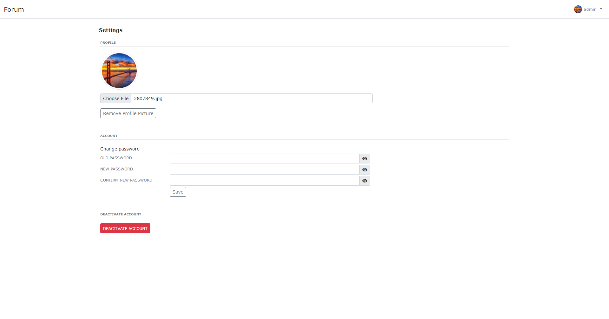
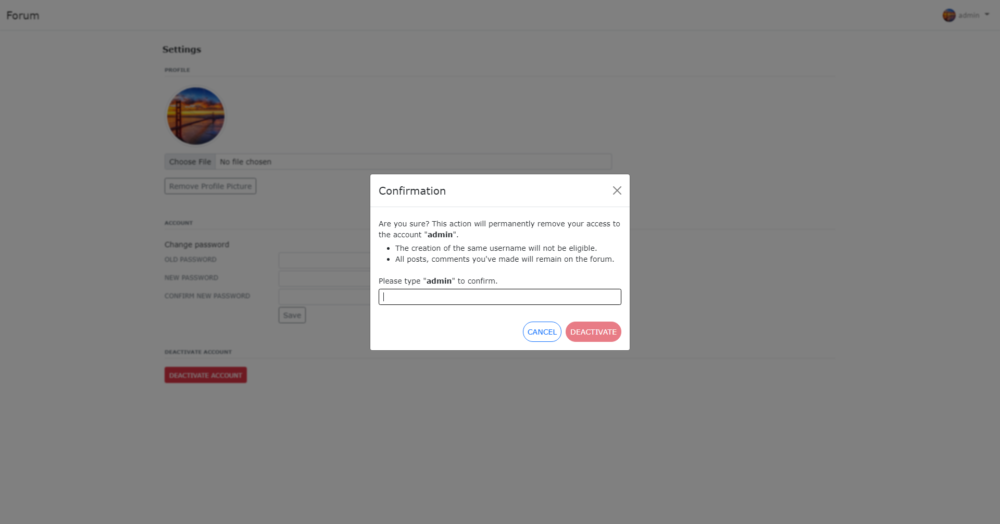
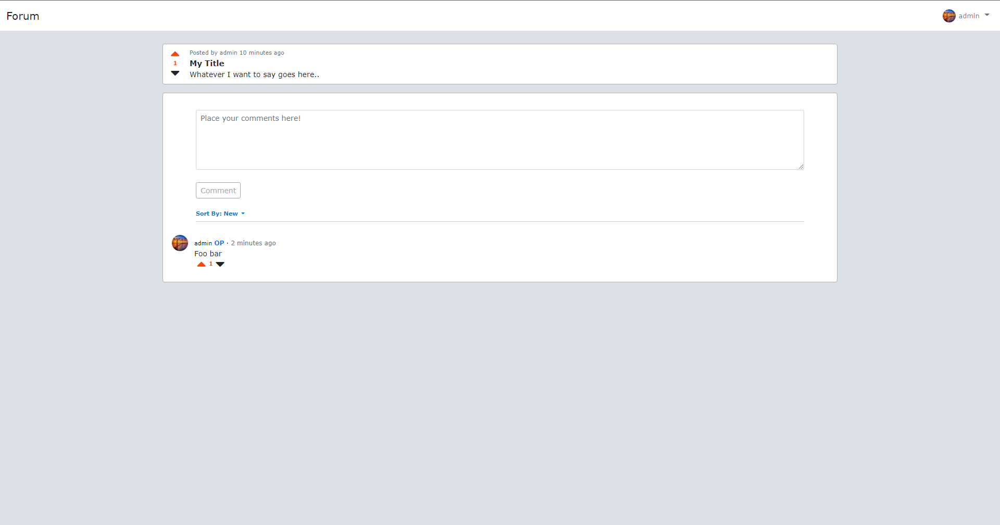
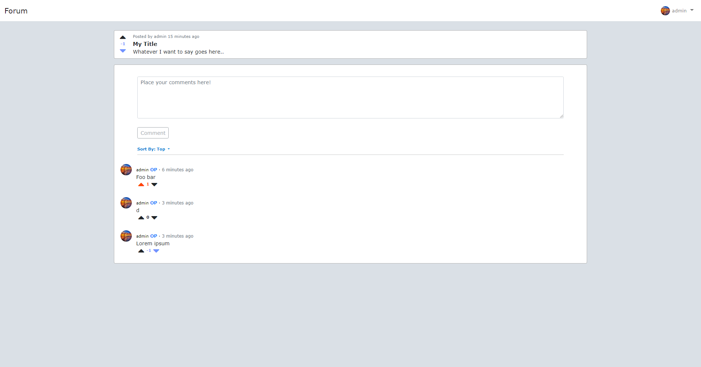
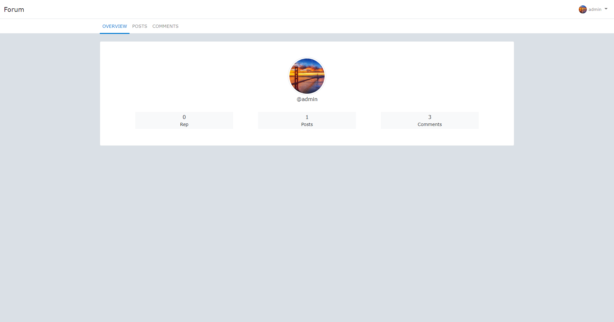
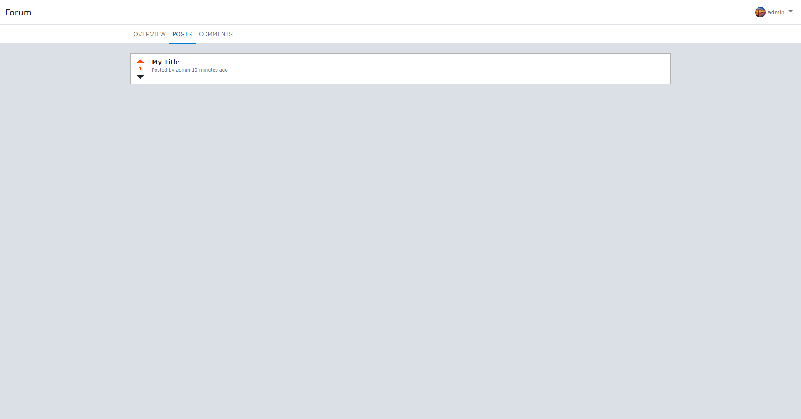
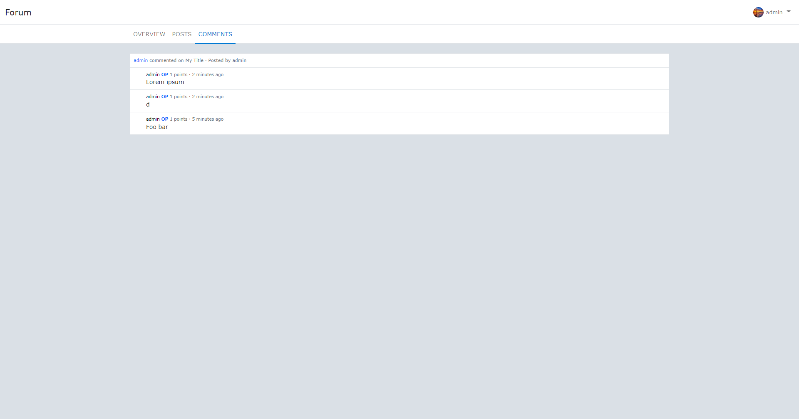

# Forum

A social media web application that lets people socialize, share their stories, and react with votes/comments.

## Table of Contents

* [Description](#description)
    * [Features](#features)
    * [Built With](#built-with)
* [Installation](#installation)
* [Usage](#usage)
    * [Video Demo](#video-demo)
    * [Text Example Workflow](#text-example-workflow)
    * [Screenshots](#screenshots)
* [Structure/Design of Program](#structuredesign-of-program)
    * [Structure](#structure)
    * [Design Choices](#design-choices)
* [Future Development](#future-development)
* [Struggles/Issues](#strugglesissues)
* [Acknowledgements](#acknowledgements)


## Description

This project is heavily inspired by Reddit (has a lot of similarities) forum-like that supports the bare minimum of what a basic social media application has.

### Features

It includes the following list of features:

* Very basic authentication system login/signup using password hashes and salt
* Posting content with title and description
* Commenting on a post
* Upvoting/downvoting/unvoting a post/comment
* A profile overview of total reputation/posts/comments made
* A profile view of posts made by a certain user
* A profile view of comments made by a certain user
* Uploading and removing profile picture
* Change password
* Deactivate account

### Built With

* [Flask](https://flask.palletsprojects.com/en/2.0.x/)
* [Bootstrap](https://getbootstrap.com/)
* [JQuery](https://api.jquery.com/)
* [Jinja2](https://jinja.palletsprojects.com/en/3.0.x/)

## Installation

Below are the steps to install and run the application on your local computer.

1. Clone the repository

    ```
    git clone https://github.com/random56428/forum.git
    ```

2. Change directory to project

    ```
    cd forum
    ```

3. Install dependencies

    ```
    pip3 install -r requirements.txt
    ```

4. Run the application

    ```
    flask run
    ```

## Usage

### Video Demo

Here's a video in [action](https://youtu.be/WuNjEch-p-w).

### Text Example Workflow

Here's an example of how to use Forum: (or any social media)

1. Sign up for an account
2. Click on profile to change profile picture
3. Create a new post on a topic
4. Comment on other people's posts
5. Upvote/downvote posts and comments
6. Log out

### Screenshots
1. Signing up for an account.

    

2. Creating a post.

    

3. The created post is on the homepage!

    

4. On settings, change profile picture, password, or deactivate account.

    

5. Deactivating account confirmation popup.

    

6. Back to the created post, one can also comment.

    

7. Upvoting, downvoting, unvoting, then sort by most upvoted comments.

    

8. Profile overview shows a summary.

    

9. Profile posts tab shows all the posts made by a user.

    

10. Profile comments tab shows all the comments made by a user.

    

## Structure/Design of Program

Forum is mainly written in HTML, CSS, Javascript, and Python. Boostrap is used to position layout and style elements, it also made the pages more mobile friendly. With a dash of JQuery, which handles the event listeners and sends AJAX requests to dynamically display elements. And Jinja to render the templates returned by Flask.

### Structure

Below are the descriptions of each file in the application:

* **`app.py`** - This is the main starting point of the app. It contains all the routes and endpoints which ultimately returns html back to the client to view. For each route, it queries the database and renders the html template. The routes have their necessary guards (checks) to notify the client if something went wrong by flashing or a hidden message.
* **`helpers.py`** - This contains helper functions. For now, it implements a login required decorator so that non-logged in users are redirected to login page.
* **`layout.html`** - This is a template that each page will inherit. It contains all the cdns and includes Flask moment to display datetime. There is a navbar that links to the home page, profile, settings, and log out if the user is logged in. Otherwise, it displays a login and register button. A custom flash message to display whether an action is successful or not.
* **`index.html`** - This is the homepage that displays all the posts ever made. The button "Create Post" links to creating a new post. There are two buttons to sort the posts from newest and most upvoted, the default is newest. Within each post, there is an upvote/downvote button to increase/decrease the post's total votes, a link to poster's profile, and by clicking the post leads to the post with comments.
* **`login.html`** - Login page that prompts for username and password. Users without an account could click the register link that brings them to the register page.
* **`register.html`** - Register page that prompts for username, password, and confirmation password. A text indicates that the username must be letters, numbers, underscores, hyphens and could not include special characters/spaces. This is a design choice to reduce number of similarities and unreadable usernames.
* **`newpost.html`** - This page creates new posts. On the page, there is a title input that limits 300 characters and a description field to accompany the title. The description is optional and has a hard limit of 40000 characters. This is to prevent a post from taking a lot of space.
* **`post.html`** - This represents a post with it's total votes, title, description, time posted, and who posted it. There is a comment text field to add comments to the post; it sends an AJAX request and can only be called in 5 second intervals to prevent spamming. Each comment is listed in default newest order which can be modified with the sort dropdown with most upvoted. Each comment is detailed with the user's profile picture, username (both of which are clickable links to their profile), time commented, comment text, and total votes. If a comment is made by the poster, an "OP" label appears beside their username. If there are no comments, a "No Comments Here" is displayed.
* **`profile.html`** - This is the overview of a user. It contains the profile picture, total reputation, and total comments/posts made. The secondary navbar below the main navbar signifies which section of the profile is currently displayed. Note that the endpoint in the URL determines the users profile.
* **`profileposts.html`** - All the posts the user made is displayed in newest order (didn't create sorting) with their total votes, time posted, and title. The poster's username is clickable and links to the profile overview. And clicking the post links to the post itself. If no posts were made by the user, a "@{{user}} hasn't posted anything." is displayed.
* **`profilecomments.html`** - All the comments the user made is displayed in newest order (didn't create sorting) with their total votes, time commented, and description. If the user who commented is the poster, an "OP" label is shown. The comments are positioned below their respective post blocks. The usernames and post title are clickable links to profiles and posts. Clicking on the post block links to the post, and clicking the comment links to the post and automatically scrolls to the comment highlighted in light blue. If no comments were made by the user, a "@{{user}} hasn't commented anything." is displayed.
* **`settings.html`** - The settings of logged in user. There are three sections: changing profile picture, changing password, and deactivating account. The uploaded picture is given a randomized uuid name and is stored in the web server/disk. There is an option to remove current profile picture and revert back to default. An error message is shown if an error arises (e.g. file size > 2 MB, unsupported file extension, empty file). The user must have their current password to change passwords. An error message is shown if an error arises (e.g. passwords don't match). The deactivation button blurs the background (because aesthetics), and brings up a confirmation modal that the user must type their username in the box to activate the deactivation button. Deactivating redirects the user to the login page and that username cannot be created again.

* **`forum.db`** - A SQLite3 database that contains 6 tables: "users", "sqlite_sequence", "posts", "comments", "post_votes", and "comment_votes". For more information, enter `sqlite3 forum.db` followed by `.schema` in the terminal.

* All the `.css` files in `static/css` accompany their `.html` files based on their names.
* There are two directories of `.js` files; `static/js` for static files, and `templates/js_dynamic` for files that require dynamic rendering through Jinja (This can be fixed through hard coding urls in AJAX requests but I believe is not necessary).

### Design Choices

Sometimes there are many factors that affect how I implement a solution such as how user friendly is it? How efficient is it? Is it easy to implement? How easy is it to read the code? 

Here are some design choices I made:

* For sorting posts/comments from newest or top upvoted, I chose to render template from Flask rather than dynamically generating through AJAX requests because inserting multiple huge HTML blocks could get ugly fast (e.g. in `post.js`, a messy HTML comment is inserted). Although it may allow better user experience as the page is not refreshed, I believe that the ability to read and maintain code is more important in this case.
* To update a page, dynamic or not? For each and every feature, if it improves the user's experience, I would opt in for dynamic. I believe a user would not enjoy refreshing a page on every new comment or picture upload.
* I created a `templates/js_dynamic` directory so that the AJAX requests could use Jinja for the url location. Most large chunks of javascript files should remain in the `static` folder but I also did not want to hard code a url because if the route changed, I would have to change it in two places.
* When a user decides to deactivate an account, their account is not actually deleted. Deactivation indicates that their active status is set to 0, thus their posts does not appear in the home page and their username is replaced with _\[deleted\]_ but if one possess the deactivated user's post URL, the title is still visible. This is a reddit feature that I like; although the text description is removed, the title is still there so that not everything is censored. In addition to not straight up deleting the data, if the user decideds to reopen their account, they gain all their posts/comments back.
* The reason I opted to create randomized uuid profile picture file names is so that there is a smaller probability that uploaded files have the same name and overwrite.
* How would I keep track of which user upvoted which post or comment? I thought of keeping track of the votes inside the users table but then a foreign key will have to be pointing to the posts table (when posts is already pointing to users). This increases coupling so a different table is necessary. How would each vote be stored? I decided to use -1 for a downvote, 0 for no votes, and 1 for an upvote.

## Future Development

Some things to consider in the future:

* Refactor duplicate code - I had to go back and forth changing all occurences which became tedious really quick.
* Take off CS50's SQL abstraction and use SQLite3/SQLAlchemy.
* Sorting support for profile posts and comments.
* Users can include images in their post.
* Implementing email support, forgot password, stronger authentication.
* Unit tests

## Struggles/Issues

Obstacles I faced in this project:

* I'm relatively new to these programming/scripting/markup languages and frameworks so it took time to apply concepts to this project.
* When storing information in a database, it's often hard to visualize how to store data because everything is connected in some way (e.g. How do I store an individual user's votes on a specific post and which variable is connected?)
* As more and more features were introduced to the project, the code became cluttered and so it was hard to debug - I believe a solution to this is refactoring.

Issues for future development:

* The post comment 5 second limit interval is only client side, which means the user could refresh the page to bypass this limit - implement a server side to check.
* The algorithm for reputation is incorrect. It currently only prevents users from gaining infinite upvotes, but it does not stop them from gaining infinite downvotes. Creating a post/comment and downvoting themselves would decrease reputation.

## Acknowledgements

* [Font Awesome](https://fontawesome.com/)
* [CS50's SQLite3](https://cs50.readthedocs.io/libraries/cs50/python/)
* [Flask-Moment](https://github.com/miguelgrinberg/Flask-Moment)
* [Flask-Session](https://github.com/fengsp/flask-session)
* [Reddit](https://www.reddit.com/)